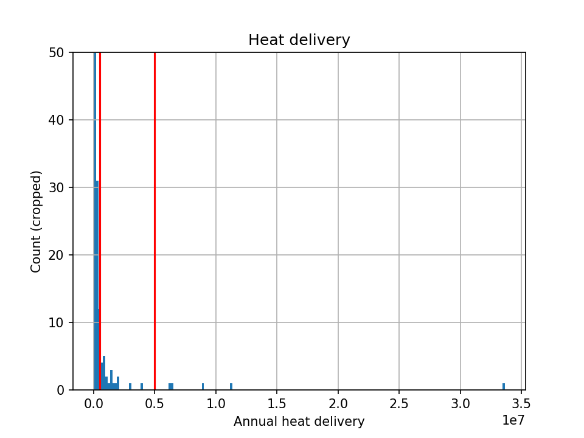
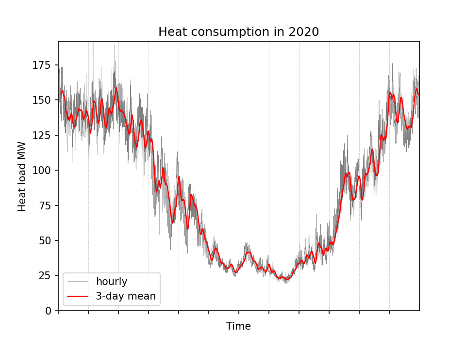
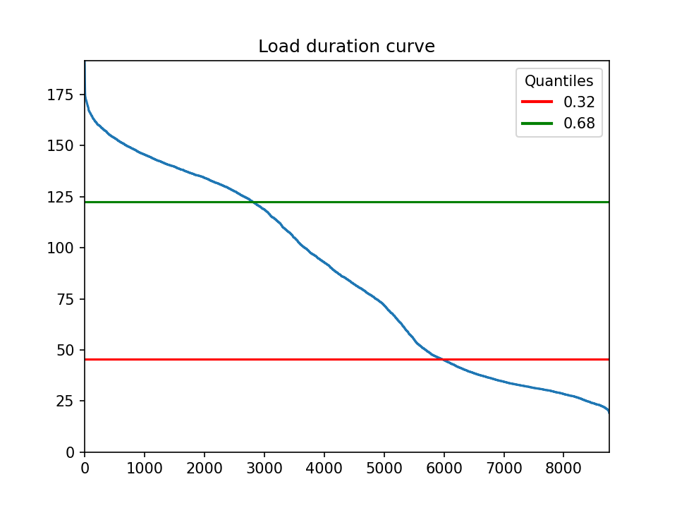
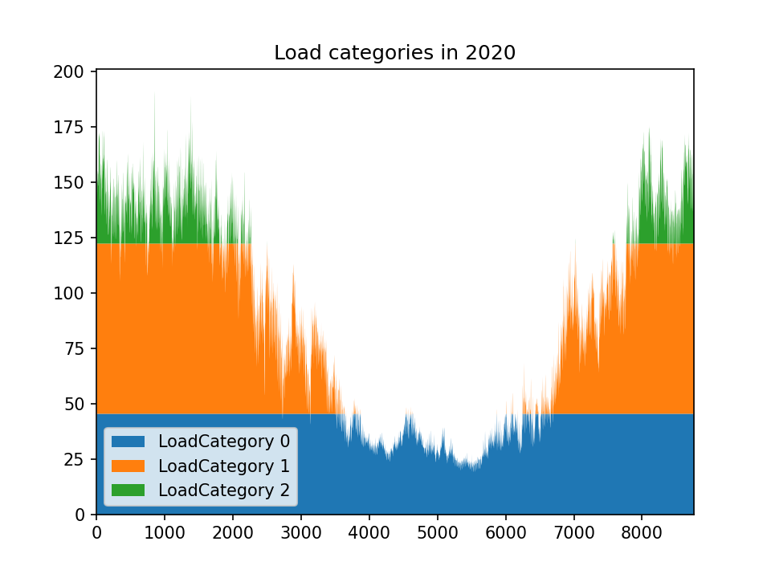

# Portfolio Notes

## Heat demand

### Characterisation of Danish DH networks
The annual heat delivery from Danish DH networks is plotted in the histogram below, and  classified into three categories:
- Small (< 0.5 PJ)
- Medium (0.5 - 5 PJ)
- Large (> 5 PJ)

This results in the following classification:

| Large              | Medium                       |
|--------------------|------------------------------|
| Storkøbenhavns     | Esbjerg-Varde                |
| Århus              | Herning-Ikast                |
| Fyn                | Nordøstsjællands             |
| Aalborg            | Randers                      |
| TVIS               | Holstebro-Struer             |
|                    | Kalundborg                   |
|                    | Horsens                      |
|                    | Hillerød-Farum-Værløse       |
|                    | Silkeborg                    |
|                    | Hjørring (inkl. Hirtshals)   |
|                    | Viborg                       |
|                    | Sønderborg                   |
|                    | Aabenrå - Rødekro - Hjordkær |
|                    | Hammel                       |
|                    | Næstved                      |
|                    | Slagelse                     |
|                    | Nykøbing Falster             |
|                    | Nyborg                       |
|                    | Frederikshavn                |
|                    | Thisted                      |
|                    | Svendborg                    |
|                    | Maribo                       |
|                    | Rønne                        |
|                    | Haderslev                    |
|                    | Skive                        |
|                    | Grenå                        |

### Heat profile
The hourly profile of heat load is based on CPH's DH network (2020), but scaled-down proportionally to the mean of "medium" and "large" DH networks. The mean corresponds to 3.17 PJ (closest to **Herning-Ikast DH** - 65000 urban population), or to a scale factor of 9.4%. The scaled down profile is shown below.

### Definition of load categories

The heat load is classified into "*baseload*", "*midload*", and "*peakload*". The classification is based on the heat load duration curve, trying to separate different growth regimes. The chosen thresholds are shown below, and correspond to **32% of the hours with peakload operation, and 68% for midload operation**.

## Cold demand
A data center is chosen as a waste-heat source, with the hourly profile assumed constant throughout the year.
The size of the DC is chosen to represent a specific share of potential WHR in the DH network. The following table shows the share of the waste heat source, and the share of the recovered waste heat. **A capacity of 1 MW is selected.**

| Capacity | Share WH   | Share WHR |
|----------|------------|-----------|
| 1 MW     | 1.16 %     | 4.17 %    |
| 2 MW     | 2.32 %     | 8.35 %    |
| 3 MW     | 3.48 %     | 12.52 %   |
| 4 MW     | 4.64 %     | 16.70 %   |
| 5 MW     | 5.80 %     | 20.87 %   |
| 10 MW    | 11.60 %    | 41.75 %   |
| 15 MW    | 17.39 %    | 62.62 %   |

## Portfolios

### Waste-heat source (DC)
- The DC has two technologies ("*electric chiller*" and "*free cooling*") already installed with each a capacity of the peak cooling need.
- The DC can install the technology *"HP - waste heat"*, and find the optimal capacity and operation of it.

### DH network

See further details in ***generator-cost-position-estimation.xlsx*** in onedrive.

| Type      | Fossil               | Biomass               | Electric              |
|-----------|----------------------|-----------------------|-----------------------|
| Baseload  | HOB - natural gas    | CHP - wood chips      | HP - seawater         |
| Midload   | CHP - coal           | CHP - biomass residues| HP - air              |
| Peakload  | CHP - natural gas    | HOB - wood pellets    | HOB - electricity     | 
